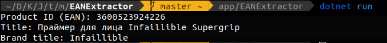

# EANExtractor
Application extracting EAN code of the product From variable containing fragment of code of website.

## Run application
in `./app/EANExtractor`
```bash
dotnet run
```


____
## Run unit tests
in `./test/ParserTest/`
```bash
dotnet test
```

# Technologies & Libraries
- .NET v6.0.400
- HtmlAgilityPack
- Newtonsoft.Json
- XUnit